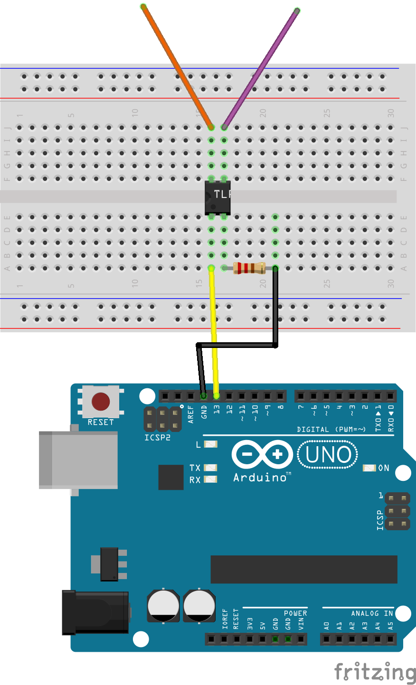
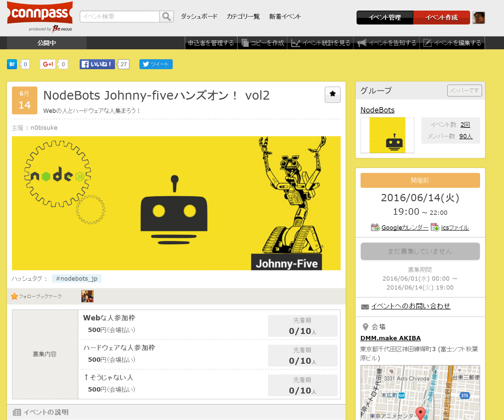

# たくさんの人で操縦できる ラジコンを作ってみた
IoT縛りの勉強会! IoTLT vol.15 @ 日本IBM

いわたん @iwata_n

[イベントページ](http://iotlt.connpass.com/event/31396/)

---

# 自己紹介

いわたん

Twitter @iwata_n

組込系企業で組込以外のソフトを書いてるけど、

8月からWeb系の会社へ華麗なる転身

Like:Node.js / React.js / Python / C / IoT / Vi / Beer

---

今日はBeams Hackの話をしようと思ってましたが、

<s>LTにネタ被りがあった</s> 
端にも棒にも引っかからなかったので別の話します

---

## Twitch Plays Pokemonって知ってますか？

http://wired.jp/2014/03/04/twitch-plays-pokemon-victory/

--

<iframe width="560" height="315" src="https://www.youtube.com/embed/47cYJWcAyYI" frameborder="0" allowfullscreen></iframe>

--

大勢の人が規定時間内にチャットで入力したコマンドで

多数決をとって動かしてポケモンをクリアする

--

同じようなことを物理的なモノでやったらおもしろいんじゃね？？？

---

# ということで たくさんの人で操縦できる ラジコンを作ってみた

--

# デモと解説

--

<iframe src="demo.html" height=450 width=100%></iframe>

http://goo.gl/NGrgxl
--

# 構成図

--

- リモコンのスイッチを改造
 - 電波出す部分を改造すると色々あぶない
- 通信部分はMilkcocoaを使用
- カメラ映像はWebRTC
 - 共有は今回は諦めた

--

# 回路

--

#  めっちゃ簡単！

--

# Milkcocoa

- WebSocketとかデータベースをサクッと使える
 - 詳しくはのびすけさんか会場にいるMilkcocoaの中の人へ
- 正直今回はじめて使ったけども一晩で今回のインフラ部分相当はできる
 - プロダクトに使えるか？と言われるとのびすけさんに聞いてみよう！

--

# Johnny-five

- JavaScriptでArduinoやRaspberry Piなどを操作できるライブラリ
 - 簡単な制御であったら一晩で今回のリモコン操作程度ができる
 - ☓ミリ秒オーダーでしか制御出来ないので細かい制御に向かない
 - GR-SAKURAで動かそうとして失敗したという[話](http://sssslide.com/speakerdeck.com/shanonim/trying-iot-on-gr-sakura)があったみたい

--

---

詳しい作り方は後日某ブログにて公開予定です

@iwata_n

