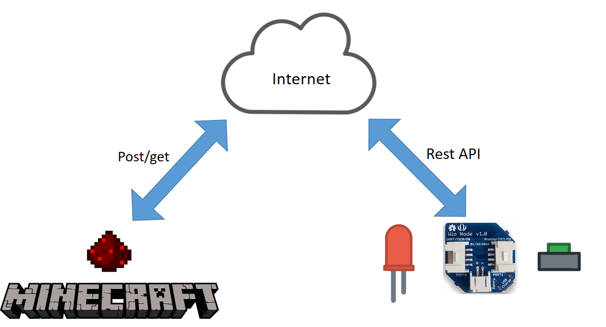

# WioNodeでMoTはじめました
## ～すべてがMになる～
IoT縛りの勉強会! IoTLT vol.17 @ ヤフー

いわたん @iwata_n

[イベントページ](http://iotlt.connpass.com/event/32233/)

---
# 自己紹介


Twitter @iwata_n

高専の機械科卒業です。7月で組込の会社辞めて8月からWeb系です

森博嗣の小説を読み漁ってます

最近[ドットスタジオ](https://dotstud.io/)で外部ライターしてます

Like:Node.js / React.js / Python / C / IoT / Vi / Beer

---

GR-COTTONでシリアル通信が始まると電源が入らない問題

Teratailで質問したらTwitterで公式アカウントから回答来た

はやく、mrubyとかNode.jsとかで使ってみたいなーﾁﾗﾁﾗ(/ω・＼)

---
# 仮想現実は、<br>いずれただの現実になります
『すべてがFになる（森博嗣著）』の登場人物、真賀田四季のセリフ

--
## VR
<p class="fragment">
VR、うんVR。面白いよ。<br>
うーん、でも俺、乱視だし上手く見えない時あるんだよなぁ
</p>
<p class="fragment">
しかも今日は **IoT** の場だし。
</p>
--
## IoTで仮想現実をただの現実にしてみよう

---
## 仮想現実
<p class="fragment">

</p>

--

## みんな大好きMinecraft

--
## ただの現実
<p class="fragment">

</p>

--
## ぼくが大好きWioNode
詳しくは[LIGブログ](http://liginc.co.jp/290031)参照

--
## ふたつを組み合わせて何ができる？
- 仮想現実で起きた事が現実にも起きる
- 現実で起きた事が仮想現実でも起きる

--
# Minecraft of Things!

---
# とういうことで早速デモ

--
<iframe src="demo.html" height=600 width=100%></iframe>

---
# 仕組み



--
## WioNode
- スマホで設定が可能
- REST APIが生成されるのでHTTPSでアクセス

--
## Minecraft
- Minecraft ForgeというMOD開発環境
 - Java
 - 資料がなさ過ぎて難しい・・・
- レッドストーン回路の入出力でWioNodeでアクセス
 - 現実→仮想現実の流れは今回諦めた

---
# 作り方
時間があれば

--
## WioNode
スマホだけで設定可能です。

設定を行うとモジュールごとにRest APIが発行されます。

詳しい設定方法は[LIGブログの記事](http://liginc.co.jp/290031)参照

--
## Minecraft
ほとんどMODの開発です。

--
### Minecraft Forgeの開発キットをダウンロード
[公式サイト](http://files.minecraftforge.net/)より開発キット（MDK）をダウンロードします。
今回は2016年7月現在で最新の1.10.2を使用します。


--
ダウンロードしたMDKを解凍します。


--
### IntelliJで開く
まずターミナル等で以下のコマンドを実行します。OSに合った、コマンドを実行してください。

windowsの場合は以下です。

```
gradlew setupDecompWorkspace
```


Linux/Mac OSの場合は以下です。

```
./gradlew setupDecompWorkspace
```

--
コマンドが成功したら、IntelliJでプロジェクトをインポートします。


--
この際に、**gradle.build** を選択するように注意してください。


--
この画面はOKです。


--
インポートが完了したら、ターミナル等で以下のコマンドを実行してください。

windowsの場合は以下です。

```
gradlew genIntellijRuns
```

Linux/Mac OSの場合は以下です。

```
./gradlew genIntellijRuns"
```

--
以下のような出力が出てきたら成功です。

```
~略~
#################################################
         ForgeGradle 2.2-SNAPSHOT-0447b4e
  https://github.com/MinecraftForge/ForgeGradle
#################################################
               Powered by MCP unknown
             http://modcoderpack.com
         by: Searge, ProfMobius, Fesh0r,
         R4wk, ZeuX, IngisKahn, bspkrs
#################################################
:genIntellijRuns

BUILD SUCCESSFUL

Total time: 37.125 secs

This build could be faster, please consider using the Gradle Daemon: https://docs.gradle.org/2.7/userguide/gradle_daemon.html
```

--
そうすると、IntelliJが警告を出すことが有ります。これは、IntelliJ以外でファイルが変更された場合に出てくる警告なので「Yes」を選択します。


--
ここまでの工程が正常に終了すると、画像のような構成になります。


--
右上の実行構成を選ぶコンボボックスから「Minecraft Client」を選択し、実行ボタンを押します。


--
この時、画像のようなエラーが出た場合、「Edit Configurations...」を押してClasspathの設定を行う必要があります。


--
以下のように「Use classpath of module：」で「forge-1.10.2-12.18.1.2014-mdk_main」を選択します。


--
ここまで設定すると、実行ボタンを押すことでMODが導入されたMinecraftが起動します。
これで、開発するための環境が整いました。

---
# MinecraftのMODの開発
Javaの解説長いので続きはGithub or ドットスタジオで公開される記事で！

---
# まとめ
- 「仮想現実は、いずれただの現実になります」
- IoTの技術を使うことで、VR以外にも仮想現実をただの現実とする事ができる
- WioNode
 - Rest APIを叩けばJavaからも操作ができる
- Minecraft ForgeGradle
 - ちょっと難しい
