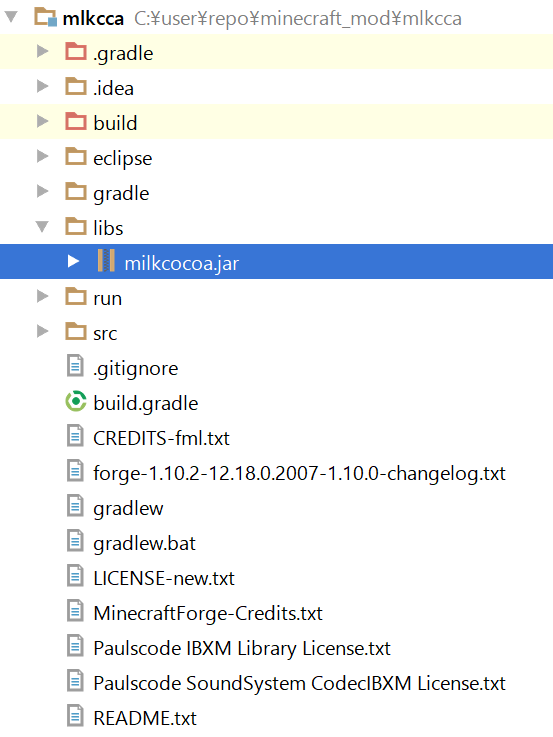
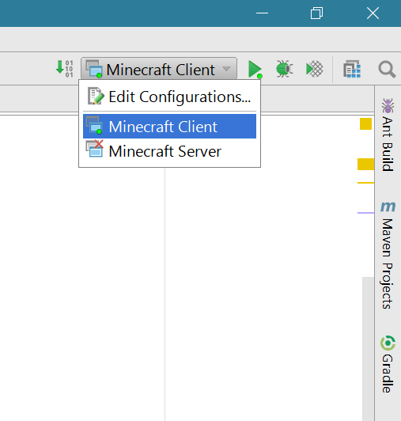
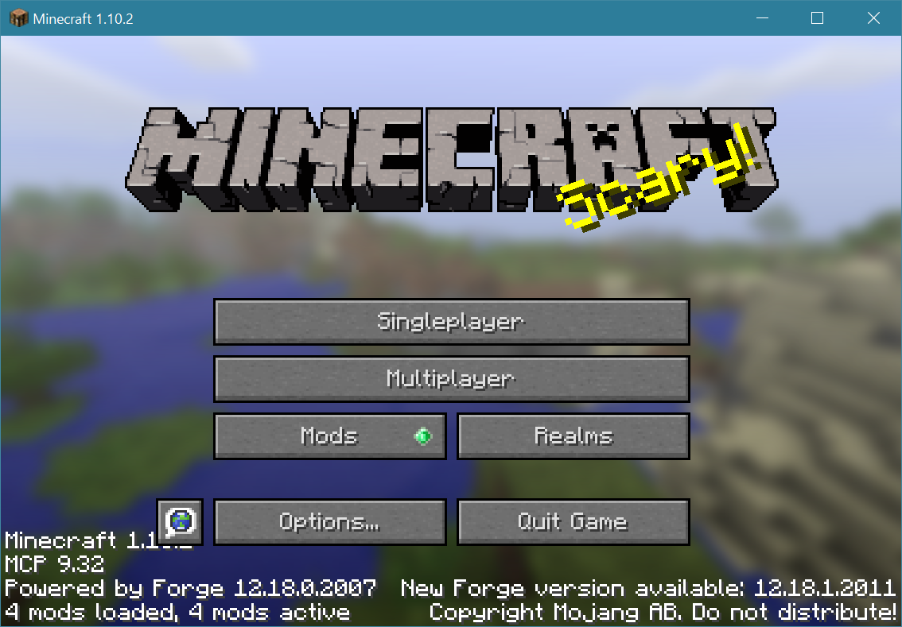

# MilkcocoaでMoTはじめました
## ～すべてがMになる～
紅白 Milkcocoa 合戦！

いわたん @iwata_n

[イベントページ](http://mlkcca.connpass.com/event/34936/)

---
# 自己紹介

Twitter @iwata_n

7月で組込の会社辞めて8月からWeb系です

森博嗣の小説を読み漁ってます

最近[ドットスタジオ](https://dotstud.io/)で外部ライターしてます

Like:Node.js / React.js / Python / C / IoT / Vi / Beer

---
# 仮想現実は、 いずれただの現実になります
『すべてがFになる』(1996年 森博嗣著)の登場人物、真賀田四季のセリフ

--
## 20年近く前にすでにVRが出てきてた

VR、うんVR。面白いよ。 
うーん、でも俺、乱視だし上手く見えない時あるんだよなぁ

--
## IoTで仮想現実をただの現実にしてみよう

--
## 仮想現実を用意します

--
## みんな大好きMinecraft

--
## ただの現実とは
- 仮想現実で起きた事が現実にも起きる
- 現実で起きた事が仮想現実でも起きる

--
Milkcocoa x Minecraft
# Minecraft of Things!

---
# とういうことで早速デモ

--
<iframe src="demo.html" height=600 width=100%></iframe>

---
# 仕組み

--
## Minecraft
- レッドストーン回路の入出力でMilkcocoaにアクセスする
- Minecraft ForgeというMOD開発環境
 - 資料がなさ過ぎて難しい・・・
 - Javaで開発

--
## MilkcocoaのJavaライブラリ?

https://github.com/milk-cocoa/milkcocoa_for_android

for Android？？？

--
## まぁ似たようなもんだし動くだろう

--
## ﾎﾟｲｰ

--
## ｶﾁｯ

--
## うごくやんけ。さすがMilkcocoa

--
## が、しかし

ライブラリの用意しているコールバック内でエラーが起きると黙って死ぬ！

ネットワークに繋がっていないとMilkcocoaのインスタンス生成時に死ぬ！

--
# (＃＾ω＾)

---
# まとめ
- IoTの技術を使うことで、VR以外にも仮想現実をただの現実とする事ができる
- Minecraft Forge
 - MOD開発ちょっと難しい
- Milkcocoa for Android
 - Java環境で普通に使える
 - gradleで配布してほしいなぁ・・・:D
 - 親切過ぎて身代わりになって死ぬ事が多い
